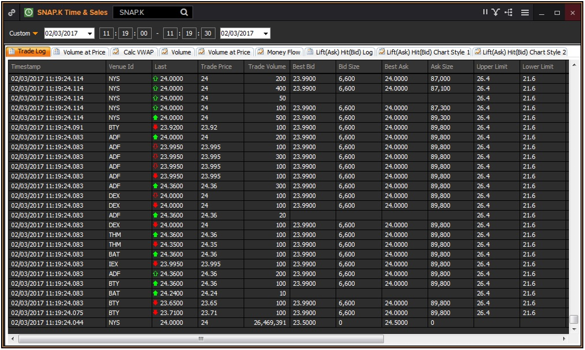

# MIFID-Test
Holder for Roland's MIFID article
# Extending the precision of timestamp supported on Elektron Real Time

## Overview

Timestamps are an integral part of any financial market data model. The precision of timestamp implemented within the financial sector is increasing in line with market data rates and in response to regulatory reporting obligations.

The current regulatory focus within the industry is MiFID II where companies declared as being High Frequency Traders are required to maintain an audit trail with a minimum of microsecond precision timestamps. This European centric regulation for greater transparency of execution is likely to be adopted in other geographies so the Elektron Real Time response prepares for higher precision timestamps across all of our global content coverage.

This article presents the implementation of higher precision timestamps through Elektron Real Time, how the precision evolution is accommodated and the technical dependencies for enabling this precision of timestamp within an enterprise.

## Content

Timestamp Strategy

Methods of access

Technical prerequisites

Wider implications of consumption

### Timestamp Strategy

At the outset, the real time data model supported a single second precision granularity of timestamp which was extended to support millisecond precision around 2005\. With higher market data rates, comes an increased likelihood of market data events having the same millisecond timestamp. This is illustrated below by the Eikon screenshot of a time series from the recent Snapchat IPO.

  

This coupled with a need for accurate regulatory reporting has resulted in the industry implementing microsecond and nanosecond timestamp support, although whether this absolutely disambiguates events from a timestamp perspective is ultimately down to the implementation at the source. In other words it would be inadvisable to rely upon the timestamp as a unique key even if it is presented with a higher precision.

These limitations have led to the extension of the existing Reuters Wire Format TIME type to support microsecond and nanosecond precision of time. A field of RWF TIME type can now support the precision of Hours, Minutes, Seconds, Milliseconds, Microseconds and Nanoseconds. The response to MiFID II has led to the introduction of additional timestamp fields within the real time data models. Additional fields have been created in order to provide compatibility for applications consuming the existing timestamp fields. Nanosecond is the maximum precision of timestamp supported – there are no plans to extend RWF TIME beyond this level of precision at this point in time.

The new timestamp fields are incorporated into the field dictionaries used by the Elektron Edge Device and Thomson Reuters Enterprise Platform. The new fields have an acronym with a suffix of “_NS”. A sample of the new fields created for MiFID II is presented below available in v4.20.17 of the field dictionary. These fields are already populated on a number of exchanges on Elektron Real Time including the Casablanca and Xetra Stock Exchanges.

<table align="center" border="1" cellpadding="0" cellspacing="0">

<tbody align="center">

<tr>

<td style="width:140px;">**Field Acronym**</td>

<td style="width:151px;">**Field Number**</td>

<td style="width:142px;">**Field Type**</td>

<td style="width:151px;">**RWF Length**</td>

</tr>

<tr>

<td style="width:140px;">ASK_TIM_NS</td>

<td style="width:151px;">14263</td>

<td style="width:142px;">TIME</td>

<td style="width:151px;">8</td>

</tr>

<tr>

<td style="width:140px;">BID_TIM_NS</td>

<td style="width:151px;">14264</td>

<td style="width:142px;">TIME</td>

<td style="width:151px;">8</td>

</tr>

<tr>

<td style="width:140px;">QUOTIM_NS</td>

<td style="width:151px;">14265</td>

<td style="width:142px;">TIME</td>

<td style="width:151px;">8</td>

</tr>

<tr>

<td style="width:140px;">SALTIM_NS</td>

<td style="width:151px;">14266</td>

<td style="width:142px;">TIME</td>

<td style="width:151px;">8</td>

</tr>

<tr>

<td style="width:140px;">TIMACT_NS</td>

<td style="width:151px;">14269</td>

<td style="width:142px;">TIME</td>

<td style="width:151px;">8</td>

</tr>

<tr>

<td style="width:140px;">INSTIM_NS</td>

<td style="width:151px;">14274</td>

<td style="width:142px;">TIME</td>

<td style="width:151px;">8</td>

</tr>

</tbody>

</table>

The use of RWF TIME allows the service to adapt to the increases in precision as the exchanges adapt without the introduction of further fields. This has an advantage over simply conveying via a UINT64 field where the consumer would need to infer the precision using other metadata or a field naming convention. And there would be a duplication of timestamp field delivery for exchanges which move from millisecond to microsecond precision, and then from microsecond to nanosecond precision.

### Methods of access

This precision of timestamp can be accessed through all APIs which expose content from an OMM source, namely:

*   RFA version 8 and above[1](#myfootnote1) (note that this API is feature complete)
*   UPA version 8 and above (strategically renamed as ETA)
*   Elektron SDK – any version (strategic)

If an application adopts the latest APIs in order to avoid a field decode error, then it is only necessary to recompile the code. However, if the application needs to take advantage of the higher precision then it will need to be modified to access to microsecond and nanosecond precision part of the time structure.

Within each of the methods of access, the consumer will be presented with a structure conveying the following timestamp constituent fields. Note that a trailing zero optimization within the encoder means that a higher precision timestamp can be encoded into fewer Bytes as illustrated below:

<table align="center" border="1" cellpadding="0" cellspacing="0">

<tbody align="center">

<tr>

<td style="width:167px;">**Constituent Field**</td>

<td style="width:170px;">**Encoded Buffer Length (Bytes)**</td>

<td style="width:149px;">**Default**</td>

<td align="center" style="width:166px;">**Time Encoded At Source**</td>

</tr>

<tr>

<td style="width:167px;">Hours</td>

<td style="width:170px;">2</td>

<td style="width:149px;">-</td>

<td align="center" style="width:166px;">12:01:00:000:000:000</td>

</tr>

<tr>

<td style="width:167px;">Minutes</td>

<td style="width:170px;">2</td>

<td style="width:149px;">-</td>

<td align="center" style="width:166px;">12:01:00:000:000:000</td>

</tr>

<tr>

<td style="width:167px;">Seconds</td>

<td style="width:170px;">3</td>

<td style="width:149px;">00</td>

<td align="center" style="width:166px;">12:01:01:000:000:000</td>

</tr>

<tr>

<td style="width:167px;">Milliseconds</td>

<td style="width:170px;">5</td>

<td style="width:149px;">000</td>

<td align="center" style="width:166px;">12:01:01:001:000:000</td>

</tr>

<tr>

<td style="width:167px;">Microseconds</td>

<td style="width:170px;">7</td>

<td style="width:149px;">000</td>

<td align="center" style="width:166px;">12:01:01:001:001:000 12:01:01:000:001:000</td>

</tr>

<tr>

<td style="width:167px;">Nanoseconds</td>

<td style="width:170px;">8</td>

<td style="width:149px;">000</td>

<td align="center" style="width:166px;">12:01:01:001:001:001</td>

</tr>

</tbody>

</table>

### Technical prerequisites

In addition to developing against a strategic version of API, the real time environment must be configured to a minimum level in order to receive and distribute a timestamp with a precision greater than millisecond.

The feed itself must be provided from a version of Elektron Edge Device of 2.5.6 or higher configured to allow high precision timestamps to flow. This version, and the next, can be configured to truncate the timestamp to a maximum of millisecond precision in order to protect downstream consumers which are not ready to consume this precision of timestamp. So in effect, it behaves in the same way as Elektron Edge Device 2.5.4 which does this by default.

If the application consumes the feed via a TREP, then the TREP must be at a version of 2.6.10 or higher, its real time interface with the Elektron Edge Device must use RSSL/OMM and the backbone must be configured to use RSSL/OMM.

#### Wider implications of consumption

The enablement of higher precision timestamps within the feed will result in it being exposed to all consumers connecting directly to the Elektron Edge Device or TREP. The impact varies depending upon the API, message protocol and version which an application is developed against.

*   Legacy SSL/Marketfeed (e.g. SFC) – higher precision timestamp is blank (on TREP 2.6) or truncated to second precision (on TREP 3 onwards). So the application will continue to consume an existing timestamp field without any change

*   Earlier versions of OMM (e.g. RFA 7.2) – consuming application will receive a decode error if it attempts to decode a higher precision timestamp

<a name="myfootnote1">1</a>: Note that a 32-bit build of RFA V8 was released at the end of June 2017.

